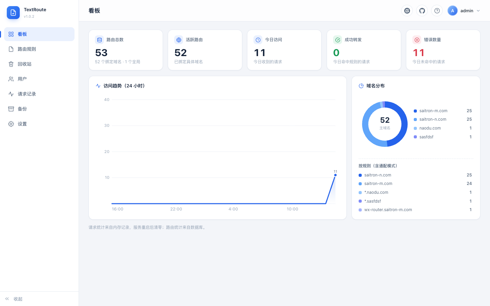
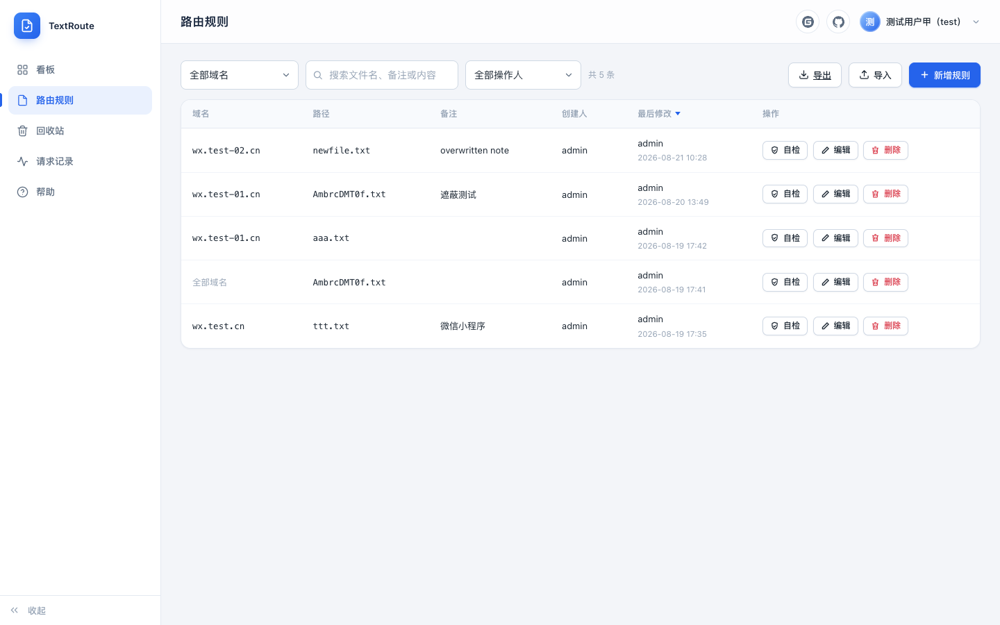
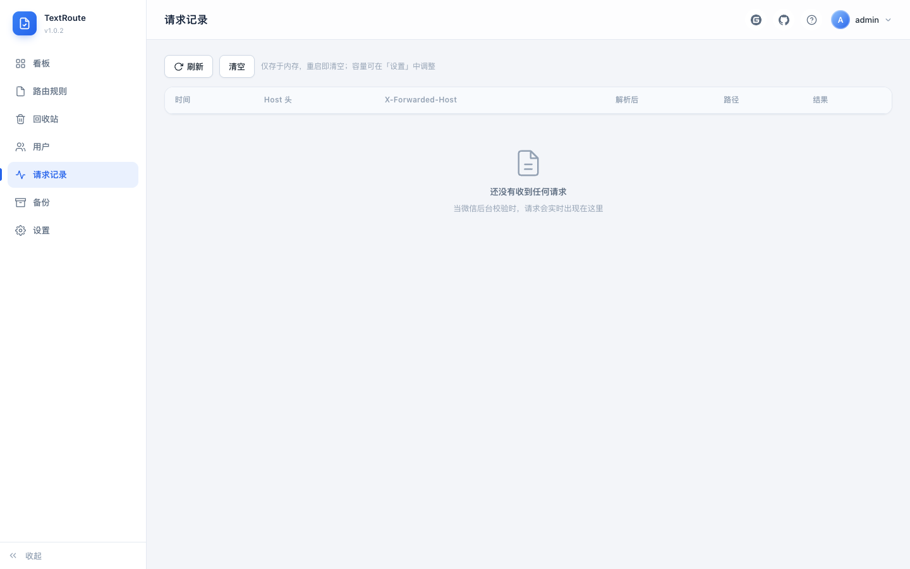
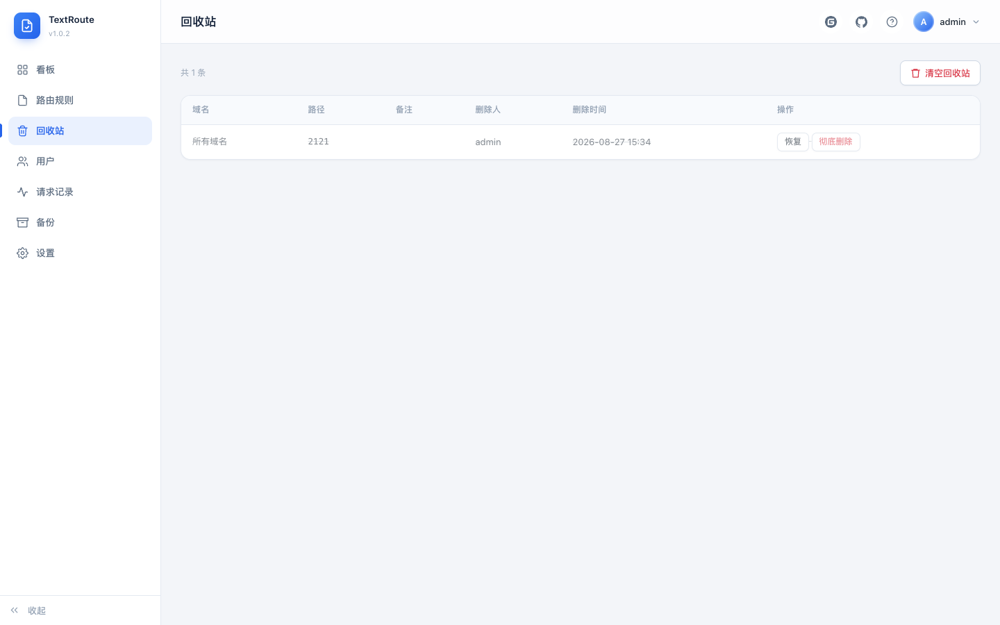

# text_router

自托管文本路由器：集中托管微信域名校验文件（`MP_verify_xxx.txt`），把任意路径的文本请求变成可见、可查、可控的流量。单进程、单 SQLite、无云依赖、无前端构建。

## 背景

微信域名校验要求把 `MP_verify_xxx.txt` 放域名根路径，保存后微信立刻来抓取。域名一多，痛点就来了：

- 校验文件散落在各台服务器，找不到、改不动
- 微信的抓取请求完全不可见，校验失败只能盲排
- 多人改文件无留痕，误删误改无法恢复

text_router 用一个统一出口解决：把要托管的路径请求转发到它，按「域名 + 路径」匹配返回内容，请求实时留痕、命中可查、规则可多人管理、备份可恢复。

## 功能特性

- 路由规则全局生效或按域名绑定，支持 `*.example.com` / `**.example.com` 通配与手动优先级，路径不限制扩展名、支持任意深度子目录（如 `h5/xxx.txt`、`.well-known/assetlinks.json`）
- 微信下载的校验文件直接**拖拽导入**，文件名内容自动填入
- 实时看板：24 小时请求趋势、命中率、按域名分布
- 两层自检：内部数据检查 + 外部真实请求验证，失败原因精确分类
- 多用户两级权限、软删除回收站、操作留痕
- 内置备份：在线快照、定时备份、一键恢复、上传恢复
- 内容保护：BOM / CRLF / 首尾空白只警告，绝不悄悄改动
- 网关友好：Nginx / Traefik / Caddy / Apache / Kong / APISIX 接入文档齐全

## 界面截图

| 登录 | 看板 |
|---|---|
|  |  |

| 路由规则 | 请求记录 |
|---|---|
|  |  |

| 回收站 |
|---|
|  |

## 快速使用

**Docker（推荐）**

```bash
docker run -d --name text_router --restart unless-stopped -p 3000:3000 \
  -v ./data:/app/data \
  -e TZ=Asia/Shanghai \
  -e SUPER_ADMIN_PASSWORD=请换成强密码 \
  crpi-1z575ueyebmvfwqg.cn-shanghai.personal.cr.aliyuncs.com/yujianpengpeng/text_router:latest
```

**docker compose**

```bash
git clone https://gitee.com/moolan_user/text_router.git   # 或 https://github.com/xingyipeng/text_router.git
cd text_router && cp .env.example .env   # 改掉 SUPER_ADMIN_PASSWORD
docker compose up -d
```

**裸机**（Node ≥ 22）：`npm install && SUPER_ADMIN_PASSWORD=xxx npm start`

打开 `http://<服务器>:3000/`，超管默认用户名 `admin`（密码即上述环境变量；数据落在 `./data`，升级镜像不丢）。

> 旧版 wx_router 部署升级：先停旧容器再拉新代码 `docker compose up -d`，旧库自动改名迁移，存量备份照常可用。

## 镜像

```
crpi-1z575ueyebmvfwqg.cn-shanghai.personal.cr.aliyuncs.com/yujianpengpeng/text_router:latest
```

镜像发布 **linux/amd64 + linux/arm64** 双架构；`latest` 指向最新稳定版，其余标签为具体版本号。升级：`docker compose pull && docker compose up -d`。

## 网关需要做什么

1. 把要托管的路径转发到本服务 3000 端口，**不重写路径**——微信校验文件必须位于根路径；路径不限制扩展名，一条规则即可转发任意路径（如 `.txt`、`.well-known/assetlinks.json`）
2. **保留原始域名**（`Host` 或 `X-Forwarded-Host`）；做不到就把规则域名填 `*` 全局生效，支持 `*.example.com` / `**.example.com` 通配与优先级

完整配置见 [docs/网关接入/](docs/网关接入/)（Nginx / Traefik / Caddy / Apache / Kong / APISIX），管理端「帮助」面板也可直接查看。

## 环境变量

| 变量 | 默认值 | 说明 |
|---|---|---|
| `PORT` | `3000` | 监听端口 |
| `DATA_DIR` | `./data` | SQLite 文件目录 |
| `BACKUP_DIR` | `./backups` | 备份目录（compose 已改为 `/app/data/backups`） |
| `SUPER_ADMIN_USER` | `admin` | 仅数据库为空时创建超管 |
| `SUPER_ADMIN_PASSWORD` | `admin123` | 同上；至少 8 位 |
| `SESSION_TTL_HOURS` | `168` | 会话有效期（小时） |
| `TZ` | `Asia/Shanghai` | 容器时区（定时备份按此时钟执行；compose 已默认） |
| `COOKIE_SECURE` | `false` | 部署在 HTTPS 后设为 `true` |
| `DOCS_DIR` | `./docs` | 帮助面板文档目录 |
| `REQUESTLOG_CAPACITY` | `2000` | 请求记录容量初始值（50-5000） |
| `SELFCHECK_TIMEOUT_SECONDS` | `8` | 规则自检超时初始值（3-30） |
| `BACKUP_ENABLED` | `false` | 定时备份开关初始值 |
| `BACKUP_TIME` | `23:00` | 备份时间初始值 |
| `BACKUP_KEEP` | `7` | 备份保留份数初始值 |

数据库非空时 `SUPER_ADMIN_*` 被忽略；`REQUESTLOG_CAPACITY` 等运行级设置仅在**数据库无记录**时作为初始值，之后在管理界面「设置」页修改、以数据库为准。默认密码 `admin123` 是弱口令，首次登录后请立即修改。裸机部署自动加载根目录 `.env`（示例见 `.env.example`），Docker 由 compose 注入环境变量。

## 使用要点

- **拖拽导入**：微信下载的 `.txt` 拖进新增对话框，文件名内容自动填入
- **自检**：内部检查数据正确性（含「被全局规则遮蔽」检测），外部真实发起一次 HTTPS 请求验证链路；失败原因精确分类
- **内容保护**：微信要求逐字节精确匹配，BOM / CRLF / 首尾空白只标黄警告，点「一键清理」才改动
- **批量迁移**：规则可导出 JSON、导入合并（重复可选跳过或覆盖）
- **子目录路径**：路径不限制格式（任意扩展名/字符均可，非空、总长 ≤255、不以 `/` 开头）；微信校验文件本身仍须根路径

## 权限与账号

两级权限：超管（管用户 + 管文件）与普通用户（只管文件）。超管不可禁用不可降级；删用户是软禁用，记录归属保留。改密码清除该用户全部会话。超管密码丢失：

```bash
docker compose exec app node scripts/reset-super-password.js <新密码>
```

## 备份

超管在「备份」页操作：

- **立即备份**：SQLite 在线备份 API，不停机一致快照
- **定时备份**：默认关闭；开启后每天 23:00 执行（按容器时区，默认 `Asia/Shanghai`）、保留 7 份
- **恢复**：校验完整性 → 现有库留底 → 替换后自动重启（Docker 的 `restart: unless-stopped` 已配置）
- **上传恢复**：另一台服务器的库文件直接上传，迁移无需登录服务器

CLI 与界面共用同一套逻辑（兼容 cron）：`node scripts/backup.js --dir ./backups --keep 30`。

## 微信校验的几个坑

1. 内容必须**逐字节精确匹配**，尾部多个换行就失败
2. 内容**不能含 BOM**
3. 必须返回 **200 且无重定向**——链路上的 HTTP→HTTPS 跳转要为校验路径配例外
4. `Content-Type` 必须 `text/plain`（本服务已固定，并附 `no-store` 防缓存）
5. 文件必须在**域名根路径**，依赖网关不重写路径

## 排障

校验失败先看「请求记录」：**没有记录** → 请求没到本机，查网关转发；**有记录但未命中** → 看「解析后」域名与规则域名是否匹配。两者方向相反，先分清再动手。

## 开发

```bash
npm install && npm test   # 405 项测试全过（Node 22）
SUPER_ADMIN_PASSWORD=password1234 npm run dev
```

切 Node 大版本后需 `npm rebuild better-sqlite3`（原生模块 ABI 绑定；Docker 不受影响）。前端原生 HTML/JS 无构建步骤，唯一第三方文件 `public/vendor/marked.min.js`（帮助面板 markdown 渲染，MIT）。前端无自动化测试，改动后手动验证；后端有完整测试。

## 架构

```
src/
├── validate.js      纯函数：文件名校验、host 规范化、内容体检
├── password.js      scrypt 哈希与常数时间校验
├── db.js            SQLite 连接与表结构
├── repo/            仓储层，只认识数据库
├── verify.js        任意路径的规则匹配与响应
├── requestlog.js    校验请求的内存记录（排障、看板共用）
├── backup.js        备份核心：在线备份、定时调度、恢复（界面与 CLI 共用）
├── settings.js      统一设置读写
├── selfcheck.js     两层自检与错误分类
├── auth.js          会话中间件与权限守卫
├── routes/          HTTP 接口层
├── app.js           装配路由，返回 Hono 实例（测试直接用它）
├── init.js          超管初始化与密码重置
└── server.js        读环境变量、开库、监听端口
```

## 协议

[MIT](LICENSE) © 2026 yujianpengpeng——可自由使用、修改、分发与商用，仅需保留版权声明。
